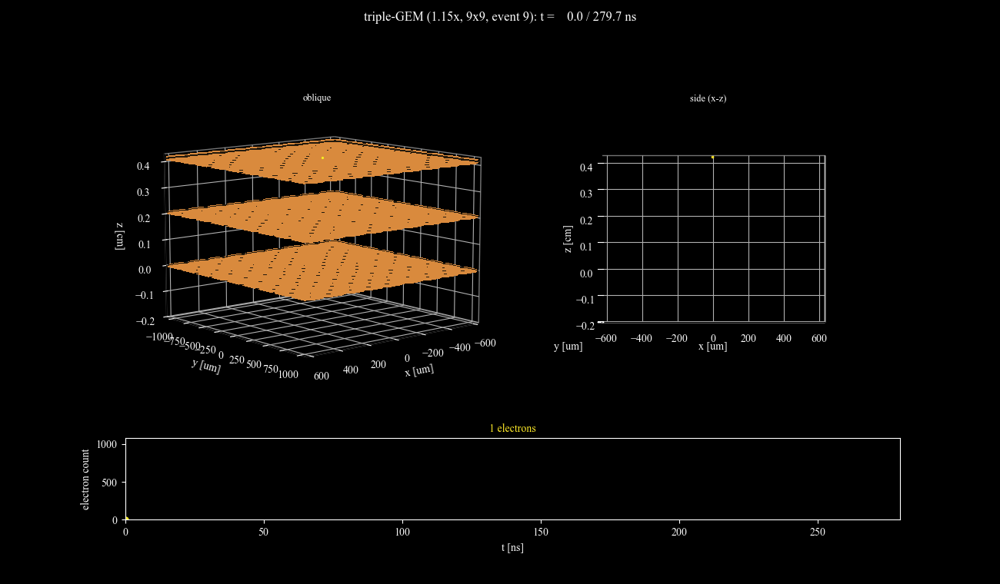

# GEM-garfield-simulation

J-PARC E72 (HypTPC) の3段GEM電場・電子雪崩シミュレーション。
将来的に開発中のGlass GEMへの展開も見据える。
`GEM_Garfield` (https://github.com/hyptpc/GEM_Garfield) の設計思想（パラメータ駆動でGmsh/Elmer入力を生成する）を
参考にしつつ、独立に作り直したもの。



上: 1イベント分の電子雪崩が3段GEMスタックを通過していく様子（斜め視点・
真横断面を並べて表示、下段に瞬間瞬間の電子数）。`visualization/plot_avalanche_animation.py`
で生成（再現・差し替え手順は同スクリプトのdocstring参照）。表示している
イベントは今後より良いものに差し替える可能性があるため、ファイル名は
`results/img/avalanche_demo.gif`に固定してある（中身だけ更新すればこの
埋め込み自体は変更不要）。

## 対象デバイス

HypTPC (J-PARC E42/E45/E72共通) の3段GEMスタック。
出典: S.H. Kim et al., "Development of a time projection chamber for J-PARC hadron physics program",
J. Phys.: Conf. Ser. 1498 (2020) 012023.

- 3層構成: 100 µm GEM → 50 µm GEM → 50 µm GEM (ドリフト側からパッド側。
  Kim et al. 2020論文の50→50→100µmとは異なる並び順を採用 -- 詳細・確認経緯は
  下記「現在のproduction condition」参照)
- ガス: P-10 (Ar 90% + CH4 10%), 1 atm

詳細パラメータは `geometry/gem_params.py`, `geometry/*_field_model.py` を参照
（`params/`によるYAML駆動化はまだ未実装、将来的な検討事項）。

## 現在のproduction condition

2026-09-24時点。数週間後にこのリポジトリを見なおしても「今どの条件が正しい
設定なのか」がすぐ分かるように、ここに一箇所にまとめる（GitHub issue #8）。
個々の値の出典・導出は `geometry/gem_params.py`, `geometry/triple_gem_field_model.py`,
`docs/debugging_notes.md`（2026-09-24の各節）を参照。

| 項目 | 値 |
|---|---|
| GEM段構成 | 100µm(GEM1, ドリフト側) → 50µm(GEM2) → 50µm(GEM3, パッド側) |
| GEM電圧 | GEM1(100µm) = 526.125 V, GEM2/GEM3(50µm) = 350.75 V（下記voltage multiplier適用後） |
| Voltage multiplier | **1.15x**（`build_triple_gem_field_mesh.py`の電圧倍率引数。base値はGEM1=457.5V, GEM2/3=305V。GEM2/GEM3の局所増幅比を10倍超にする目的で導入 -- `docs/debugging_notes.md`参照。GEM自身の電圧のみに適用され、下記drift/transfer/induction電場は倍率の対象外） |
| Drift field | 130 V/cm |
| Transfer field | 2000 V/cm |
| Induction field | 3100 V/cm |
| ガス | P-10 (Ar 90% + CH4 10%), 1 atm |
| Tiling (n_cells) | **7×7**（`triple_gem_field_v1.15x_n7`。3×3→5×5→7×7と拡張して比較した結果、5×5はまだ収束しておらずタイル境界からのラテラル脱出損失がGEM1-extracted cohortの34.2%を占めていた（7×7ではほぼ消失）ことが判明したため、2026-09-24に5×5から変更 -- 詳細は`docs/debugging_notes.md`「5x5 vs 7x7タイル収束性比較」参照。7×7自体が十分収束しているかは9×9との比較で追加確認中） |
| Avalanche size limit | 2000（`EnableAvalancheSizeLimit`）。**Penning transfer有効化後、実際に頻繁に到達することを確認**（7×7・50イベントで28イベント(56%)が上限到達、5×5でも2/50。上限到達イベントは、その時点で未処理だった電子がGarfield++の実装上トラック自体が記録されないまま切り捨てられる（`AvalancheMicroscopic::transportParticleStack`のソース確認済み）ため、透過率等の絶対値は過小評価方向のバイアスを持つ可能性がある -- 現状の解析結果はこの制約下のものとして読む必要がある。上限引き上げの要否はユーザー判断待ち |
| 電子注入位置・方向 | GEM1ホール軸近傍への非一様（軸寄り）注入、方向(0,0,-1)（診断目的の簡略化、実際の拡散後角度分布を再現するものではない -- 詳細は`macros/gem_avalanche.cpp`のコメント参照） |
| 解析手法 | plane-crossing analysis（`geometry/analyze_plane_crossings.py`）。古いendpoint-based判定は誤った結論を出していたことが判明済み（下記「ステータス」のSUPERSEDED項目参照） |
| baseName | `triple_gem_field_v1.15x_n7` |

再現コマンド一式は `docs/reference.md` の「現在のproduction condition
(`baseName` = `triple_gem_field_v1.15x_n7`) の再現手順」を参照。

## パイプライン

```
ジオメトリ生成 (Gmsh Python API) → メッシュ
  → Elmer (ElmerGrid/ElmerSolver, 静電場ソルブ) → Garfield++ (電子雪崩シミュレーション)
  → Python可視化 (PyVista/matplotlib)
```

実際にコマンドを叩いて再現する詳細手順は `docs/reference.md` を参照。

## ディレクトリ構成

```
geometry/       Gmsh Python APIによるジオメトリ・メッシュ生成スクリプト、Python可視化の一部
elmer/          .sif生成スクリプト、誘電率定義など
macros/         Garfield++実行マクロ (単段テスト、3段本番等) + CMakeビルド設定
include/        C++マクロ用のvendored third-partyヘッダ (nlohmann/json)
visualization/  PyVistaベースの3D可視化・診断プロット (issue #3)
resources/      ガステーブル (P10) 等
results/        全パイプライン段の出力（mesh/root/img/html/json、詳細はdocs/reference.md）
docs/           詳細ドキュメント（下記「ドキュメント」参照）
```

## ドキュメント

- `docs/reference.md` — パイプラインの実行手順、`results/`出力構成、ROOT出力スキーマ
- `docs/pipeline_gotchas.md` — Gmsh/Elmer/Garfield++/ROOT/Python連携で踏んだ落とし穴集
- `docs/debugging_notes.md` — GEM1→GEM2電子透過率問題の調査ログ（進行中、GitHub issue #2）
- `CLAUDE.md` — AIエージェント向けエントリポイント

## 実行環境

| ツール | バージョン |
|---|---|
| Gmsh (CLI) | 4.13.1 |
| Gmsh Python API | 4.15.2 |
| Elmer | v9.0 |
| Garfield++ | パッケージバージョン文字列 "0.3"（ROOT 6.40.04向けにビルド） |
| ROOT | 6.40.04（Python/解析用とGarfield++ビルド用で統一） |
| CMake | 3.31.8 |
| gcc | 11.5.0 |

いずれもこの実行アカウント内にローカルインストールされたもので、パスは環境固有
（`elmer/run_field_solve.sh`, `macros/CMakeLists.txt`が実際に使っているパスの
定義箇所）。このリポジトリはグローバルな環境変数設定に頼らず、リポジトリ内の
セットアップスクリプトで明示的にパスを通す方針。

Garfield++の再ビルド手順（ROOTバージョンを上げた場合など）は
`docs/pipeline_gotchas.md`を参照。

## ステータス

- [x] Gmsh Python APIのセットアップ
- [x] 単段GEM(50µm)の単位胞ジオメトリ・メッシュ生成、可視化 (`geometry/build_single_gem.py`)
- [x] 単段GEMの電場マップ生成 (`geometry/single_gem_field_model.py`, `elmer/`, `macros/view_gem_field.cpp`)
- [x] ホール内部へのガス体積の追加・Garfield++側インデックスのオフバイワン修正（詳細はコード中コメント参照）
- [x] 3Dインタラクティブビューア (`macros/export_field_samples.cpp` + Plotly artifact、`geometry/plot_3d_*.py`)
- [x] 単段GEMでの電子雪崩ゲイン計算 (`macros/gen_gas_table.cpp`, `macros/gem_avalanche.cpp`)。
      P10ガステーブル生成 → 電子雪崩が動作することを確認。V_GEM=305Vで100イベントの平均ゲイン
      8.06±8.88（統計・注入位置ともにまだ粗い一次確認。定量的な妥当性検証は未実施）
- [x] 3段GEM (ギャップ含む) の電場マップ生成 (`geometry/triple_gem_field_model.py`,
      `geometry/build_triple_gem_field_mesh.py`)。並び順は**ドリフト側から100→50→50µm**
      （Kim et al. 2020論文の50→50→100µmとは異なる、2026-09-22にユーザーへ確認済みの現行設計）。
      ドリフトギャップは実機の55cmではなく4.2mmの簡略値（近傍物理には影響しないための意図的な簡略化）。
      電位連鎖（パッド面0V基準）: 各GEM電圧305V(50µm)/457.5V(100µm, 1.5倍則)、
      トランスファー2kV/cm、インダクション3.1kV/cm、ドリフト130V/cmを積み上げ、
      カソード側で約-2542V。ElmerGridでconformalメッシュ・ElmerSolve成功、
      Garfield++での電位分布も各GEMホールで妥当な漏斗形状を確認済み
- [SUPERSEDED, see below] ~~3段GEMでの電子雪崩・ゲイン計算: 単位セル1個では二次電子が
      100%孔の壁に吸収されGEM2に到達しない問題を発見。3x3セルにタイル化して境界
      アーティファクト由来の損失(16%)はゼロにできたが、孔の壁そのものへの吸収(84%)は
      残ったまま。100イベント(終端点2354個)まで統計を増やしても到達ゼロを確認し、
      統計不足ではなく系統的な効果であることを確認 — 未解決のオープンな問題。~~
      **この結論はendpoint-based判定（電子の最終到達点だけを見る方式）とタイル無し/3x3
      タイルという、両方とも後に見直された条件に基づく。下の`[x] (current)`項目が
      現在の結論。削除はせず、判定方法自体の変遷の記録として残す。**
- [x] (current, GitHub issue #2) 3段GEMでの電子雪崩・genuine plane-crossing解析:
      「電子の最終到達点」ではなく「z平面を実際に下向きに通過したか」で判定する
      plane-crossing analysis（`geometry/analyze_plane_crossings.py`、2026-09-23導入）
      に切り替え、5x5タイル・150イベント（baseline電圧1.0x）で**GEM2を完全に通過する
      電子(28件)、GEM3にまで到達する電子(3件)を初めて統計的に意味のある数で確認**
      （`docs/debugging_notes.md`「2026-09-24: 統計を150イベントに増強」）。透過は
      非常に低いものの、ゼロではなく各段でカスケード的に効率が落ちていく描像を
      定量的に裏付け。続けて、GEM2/GEM3単体の局所増幅比が~5倍程度に留まっている
      ことを定量化し（`docs/debugging_notes.md`のgain比較節）、GEM電圧を1.15倍する
      ことでGEM2/GEM3の局所増幅比を共に10倍超（11.5x/11.7x、Penning transfer
      有効化前の値）まで引き上げ済み。その後issue #7で: (1) Penning
      transferを有効化（Garfield++内蔵の文献値パラメータ、doi:10.1088/1748-0221/5/05/P05002）、
      (2) injection方式の一様面積サンプリングへの修正、(3) **5x5タイルが
      未収束と判明** — 同条件で7x7と比較したところ、5x5ではGEM1-extracted
      cohortの34.2%を占めていたタイル境界からのラテラル脱出損失が7x7では
      ほぼ消失し、GEM2ホール進入率が2.4%→14.7%、GEM3完全通過が0/9054→
      6/7368件に増加。**production condition のtilingを5x5から7x7に
      変更済み**（9x9との比較で7x7自体の収束性も追加確認中）。(4)
      Penning有効化後は`EnableAvalancheSizeLimit(2000)`に頻繁に到達する
      ことが判明（7x7・50イベント中28イベント）— 到達イベントは電子が
      記録されないまま切り捨てられるため、絶対値は過小評価方向のバイアス
      を持ちうる、上限引き上げの要否は検討中。periodic boundary・電圧scan
      の体系化・文献比較は引き続きGitHub issue #7で進行中。検証済み/
      未検証の仮説一覧・次の一手候補・パイプライン構築時の落とし穴は
      `docs/debugging_notes.md` 参照
- [x] Python可視化レイヤー (GitHub issue #3): `macros/export_avalanche_trajectories.cpp`
      で雪崩電子の全経路をROOT出力、`visualization/plot_triple_gem.py`で
      geometry+電場スライス+電子経路+電場streamlineを1つのPyVistaシーンに
      overlay（インタラクティブHTML出力）、`visualization/plot_z_profiles.py`で
      Ez(z)/|E|(z)/Ne(z)診断プロット。いずれも`triple_gem_field`/`single_gem_field`
      両モデルで動作確認済み（モデル固有のハードコードなし）
- [x] 出力構成の整理とROOT化: 従来`geometry/output/`, `macros/output/`,
      `visualization/output/`に分散していた出力を`results/`（`mesh/root/img/html/json`
      にファイル種別ごと整理）へ一本化。電子endpoint/trajectoryのデータ出力も
      CSVからROOT TTree（`results/root/<baseName>_avalanche.root`の
      `Endpoints`/`Trajectories` tree）に変更、Python側は`uproot`で読み込み。
      詳細は `docs/reference.md` 参照
