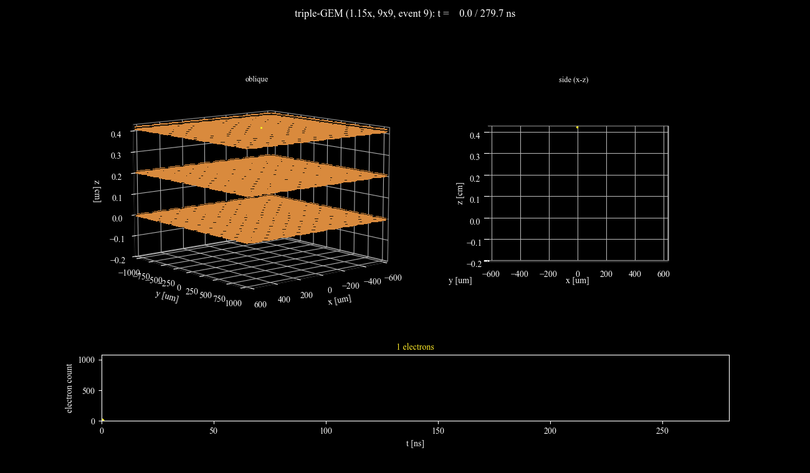

# GEM-garfield-simulation

Triple-GEM検出器の静電場・電子雪崩（avalanche/transport）をシミュレーション
するためのframework。J-PARC E72 (HypTPC) の3段GEMを対象に、将来的な
Glass GEMへの展開も見据える。

使用する主なツール: **Gmsh** (geometry/mesh) → **Elmer FEM** (静電場ソルブ)
→ **Garfield++ / Magboltz** (microscopic avalanche simulation) → **Python**
(uproot/matplotlib/PyVista、解析・可視化)。

`GEM_Garfield` (https://github.com/hyptpc/GEM_Garfield) の設計思想
（パラメータ駆動でGmsh/Elmer入力を生成する）を参考にしつつ、独立に作り直したもの。



上: 1イベント分の電子雪崩が3段GEMスタックを通過していく様子（斜め視点・
真横断面を並べて表示、下段に瞬間瞬間の電子数）。
`visualization/plot_avalanche_animation.py`で生成（再現・差し替え手順は
同スクリプトのdocstring参照）。

## 対象デバイス

HypTPC (J-PARC E42/E45/E72共通) の3段GEMスタック。
出典: S.H. Kim et al., "Development of a time projection chamber for J-PARC hadron physics program",
J. Phys.: Conf. Ser. 1498 (2020) 012023.

- 3層構成: 100 µm GEM → 50 µm GEM → 50 µm GEM (ドリフト側からパッド側。
  Kim et al. 2020論文の50→50→100µmとは異なる並び順を採用)
- ガス: P-10 (Ar 90% + CH4 10%), 1 atm

詳細パラメータは `geometry/gem_params.py`, `geometry/*_field_model.py` を参照。

## 現在のproduction condition

| 項目 | 値 |
|---|---|
| GEM段構成 | 100µm(GEM1, ドリフト側) → 50µm(GEM2) → 50µm(GEM3, パッド側) |
| GEM電圧 | GEM1 = 526.125 V, GEM2/GEM3 = 350.75 V (voltage multiplier 1.15x適用後) |
| Drift / Transfer / Induction field | 130 / 2000 / 3100 V/cm |
| ガス | P-10 (Ar 90% + CH4 10%), 1 atm、Penning transfer有効 |
| Tiling | 7×7 (`triple_gem_field_v1.15x_n7`)、9×9との比較で収束確認済み |
| Avalanche size limit | 20000 (`EnableAvalancheSizeLimit`) |
| baseName | `triple_gem_field_v1.15x_n7` |

各値の選定根拠・収束確認の詳細は `docs/validation.md` を参照。再現コマンド
一式は`docs/reference.md`「現在のproduction condition」（§2.5）にまとめてある。

## Workflow

```
ジオメトリ生成 (Gmsh Python API) → メッシュ
  → Elmer (ElmerGrid/ElmerSolver, 静電場ソルブ) → Garfield++ (電子雪崩シミュレーション)
  → Python可視化・解析 (PyVista/matplotlib/uproot)
```

各段が出力するもの: Gmsh → `.msh`メッシュ、Elmer → 電場解 (`.result`)、
Garfield++ → ROOT (`Endpoints`/`Trajectories` tree)、Python → 画像・
インタラクティブHTML。詳細は `docs/reference.md` §1-2参照。

## Quick start

`triple_gem_field`（3段GEM、baseline設定）でパイプライン全体を動かす例
（C++マクロは先にビルドが必要、`docs/reference.md`「C++マクロのビルド」参照）:

```bash
# 1. ジオメトリ・メッシュ生成
cd geometry && python3 build_triple_gem_field_mesh.py

# 2. Elmer電場ソルブ
cd ../elmer && bash run_field_solve.sh triple_gem_field

# 3. 電子雪崩の全軌跡を計算 (Garfield++)
cd ../macros/build
./export_avalanche_trajectories ../../results/mesh/triple_gem_field \
  ../../resources/ar_ch4_90_10.gas 5 -0.2029 0.8405 0.4235 0.021 \
  0.03637306695894642 0.1 0.0005 ../../results/root

# 4. 可視化・解析
cd ../../visualization && python3 plot_triple_gem.py triple_gem_field
cd ../geometry && python3 analyze_plane_crossings.py \
  ../results/root/triple_gem_field_avalanche.root
```

`zSensorMin`等の意味・値の求め方は`docs/reference.md` §2参照。3段GEM
production condition の完全な再現コマンドは同ファイル §2.5参照。KEKCC
LSFでのバッチ並列実行は`batch/run_avalanche_batch.py`（詳細は同ファイルの
docstringと`docs/reference.md` §5）。

## Repository structure

```
geometry/       Gmsh Python APIによるジオメトリ・メッシュ生成、plane-crossing等の解析スクリプト
elmer/          .sif生成スクリプト、誘電率定義など
macros/         Garfield++実行マクロ (単段テスト、3段本番等) + CMakeビルド設定
include/        C++マクロ用のvendored third-partyヘッダ (nlohmann/json)
visualization/  PyVistaベースの3D可視化・診断プロット・avalancheアニメーション
batch/          KEKCC (LSF/bsub) でのavalanche計算並列化
resources/      ガステーブル (P10) 等
results/        全パイプライン段の出力（mesh/root/img/html/json）
docs/           詳細ドキュメント（下記「ドキュメント」参照）
```

## Outputs

`results/`配下にファイル種別ごとに整理される（詳細は`docs/reference.md`
§3参照）:

- `results/mesh/` — Gmsh出力メッシュ、Elmer solve結果
- `results/root/` — 電子endpoint/trajectory (ROOT TTree、`uproot`で読める)
- `results/img/` — 静的な検証用画像・GIFアニメーション (git管理対象は`*.png`と`avalanche_demo.gif`のみ、他は再生成可能)
- `results/html/` — PyVistaのインタラクティブ3Dビューア
- `results/json/` — geometry/field sampleのメタデータ

## Current status

- Triple-GEM geometry・電場計算・avalanche simulation: 動作確認済み
- KEKCC batch (bsub) での並列実行: 動作確認済み
- Stage-by-stage transmission解析 (plane-crossing analysis): 動作確認済み
- Python可視化レイヤー (geometry/field/avalanche overlay、z方向診断プロット): 動作確認済み
- Finite-size (tiling) convergence: 7×7で収束確認済み (9×9との比較)
- Avalanche size limit convergence: 20000で収束確認済み（production condition本体(n7/n9、各50イベント)を50000と直接比較して確認、詳細は`docs/validation.md`参照）
- Production-level absolute gain validation (voltage scan・文献比較): 進行中 ([issue #15](https://github.com/rjsaito0519/GEM-garfield-simulation/issues/15))

## 既知の制約

- **注入条件**: 現在の一次電子はGEM1ホール軸近傍への簡略化された注入
  （診断目的、実機のdrift/diffusion後の分布を再現するものではない）
- **Periodic boundary condition**: 未実装（現状は有限タイルでの近似、[issue #15](https://github.com/rjsaito0519/GEM-garfield-simulation/issues/15)）
- **誘電体近似**: dielectric layerは比誘電率のみでモデル化（詳細構造は簡略化）

## ドキュメント

- `docs/installation_guide.pdf`（日本語版: `docs/installation_guide_ja.pdf`。
  LaTeXソースはそれぞれ`docs/installation_guide.tex` /
  `installation_guide_ja.tex`）— Gmsh/Elmer/Garfield++/ROOT/Pythonの
  詳細なインストール手順（バージョン互換性の制約、ビルド順序、既知の
  落とし穴を含む）
- `docs/reference.md` — パイプラインの実行手順、production condition再現、
  `results/`出力構成、ROOT出力スキーマ
- `docs/validation.md` — production baseline configuration一式、収束確認結果、
  efficiency等の物理量定義
- `docs/debugging_notes.md` — 開発中の調査ログ・仮説検証の記録（日付順）
- `docs/pipeline_gotchas.md` — Gmsh/Elmer/Garfield++/ROOT/Python連携で踏んだ落とし穴集
- 関連する主な GitHub Issues: [#15](https://github.com/rjsaito0519/GEM-garfield-simulation/issues/15) (periodic boundary・voltage scan・文献比較、今後の作業)

## 実行環境

| ツール | バージョン |
|---|---|
| Gmsh (CLI) | 4.13.1 |
| Gmsh Python API | 4.15.2 |
| Elmer | v9.0 |
| Garfield++ | パッケージバージョン文字列 "0.3"（ROOT 6.40.04向けにビルド） |
| ROOT | 6.40.04（Python/解析用とGarfield++ビルド用で統一） |
| CMake | 3.31.8 |
| gcc | 11.5.0 |

いずれもこの実行アカウント内にローカルインストールされたもので、パスは環境固有
（`elmer/run_field_solve.sh`, `macros/CMakeLists.txt`が実際に使っているパスの
定義箇所）。Garfield++の再ビルド手順（ROOTバージョンを上げた場合など）は
`docs/pipeline_gotchas.md`を参照。

---

# GEM-garfield-simulation (English)

A framework for simulating the electrostatics and electron avalanche
(avalanche/transport) of a Triple-GEM detector. Targets the 3-stage GEM
stack of J-PARC E72 (HypTPC), with an eye toward a future Glass GEM
extension.

Main tools used: **Gmsh** (geometry/mesh) → **Elmer FEM** (electrostatic
solve) → **Garfield++ / Magboltz** (microscopic avalanche simulation) →
**Python** (uproot/matplotlib/PyVista, analysis and visualization).

Built independently, taking inspiration from the design philosophy of
`GEM_Garfield` (https://github.com/hyptpc/GEM_Garfield) (generating
Gmsh/Elmer input in a parameter-driven way).


Above: one event's worth of electron avalanche passing through the
3-stage GEM stack (an oblique view and a straight-on cross section side
by side, with the instantaneous electron count shown below). Generated
by `visualization/plot_avalanche_animation.py` (see that script's own
docstring for how to reproduce/regenerate it).

## Target device

The 3-stage GEM stack of HypTPC (shared by J-PARC E42/E45/E72).
Source: S.H. Kim et al., "Development of a time projection chamber for
J-PARC hadron physics program", J. Phys.: Conf. Ser. 1498 (2020) 012023.

- 3-layer stack: 100 µm GEM → 50 µm GEM → 50 µm GEM (drift side to pad
  side. A different stacking order from Kim et al. 2020's own 50→50→100µm)
- Gas: P-10 (Ar 90% + CH4 10%), 1 atm

See `geometry/gem_params.py`, `geometry/*_field_model.py` for detailed
parameters.

## Current production condition

| Item | Value |
|---|---|
| GEM stack | 100µm(GEM1, drift side) → 50µm(GEM2) → 50µm(GEM3, pad side) |
| GEM voltage | GEM1 = 526.125 V, GEM2/GEM3 = 350.75 V (after applying the 1.15x voltage multiplier) |
| Drift / Transfer / Induction field | 130 / 2000 / 3100 V/cm |
| Gas | P-10 (Ar 90% + CH4 10%), 1 atm, Penning transfer enabled |
| Tiling | 7×7 (`triple_gem_field_v1.15x_n7`), convergence confirmed against 9×9 |
| Avalanche size limit | 20000 (`EnableAvalancheSizeLimit`) |
| baseName | `triple_gem_field_v1.15x_n7` |

See `docs/validation.md` for the rationale behind each value and
convergence-check details. The full command sequence to reproduce it is
in `docs/reference.md`, "現在のproduction condition" (§2.5).

## Workflow

```
Geometry generation (Gmsh Python API) → mesh
  → Elmer (ElmerGrid/ElmerSolver, electrostatic solve) → Garfield++ (electron avalanche simulation)
  → Python visualization/analysis (PyVista/matplotlib/uproot)
```

What each stage outputs: Gmsh → `.msh` mesh, Elmer → field solution
(`.result`), Garfield++ → ROOT (`Endpoints`/`Trajectories` tree), Python →
images/interactive HTML. See `docs/reference.md` §1-2 for details.

## Quick start

An example of running the whole pipeline for `triple_gem_field` (3-stage
GEM, baseline settings) (the C++ macros need to be built first, see
`docs/reference.md`, "C++マクロのビルド"):

```bash
# 1. Geometry/mesh generation
cd geometry && python3 build_triple_gem_field_mesh.py

# 2. Elmer electrostatic solve
cd ../elmer && bash run_field_solve.sh triple_gem_field

# 3. Compute the full electron avalanche trajectories (Garfield++)
cd ../macros/build
./export_avalanche_trajectories ../../results/mesh/triple_gem_field \
  ../../resources/ar_ch4_90_10.gas 5 -0.2029 0.8405 0.4235 0.021 \
  0.03637306695894642 0.1 0.0005 ../../results/root

# 4. Visualization/analysis
cd ../../visualization && python3 plot_triple_gem.py triple_gem_field
cd ../geometry && python3 analyze_plane_crossings.py \
  ../results/root/triple_gem_field_avalanche.root
```

See `docs/reference.md` §2 for what `zSensorMin` etc. mean and how to
derive their values. The full reproduction command for the 3-stage GEM
production condition is in the same file's §2.5. Parallel execution on
the KEKCC LSF batch system is `batch/run_avalanche_batch.py` (see that
script's own docstring and `docs/reference.md` §5 for details).

## Repository structure

```
geometry/       Geometry/mesh generation via the Gmsh Python API, plus analysis scripts (plane-crossing, etc.)
elmer/          .sif generation script, dielectric-constant definitions, etc.
macros/         Garfield++ execution macros (single-GEM tests, 3-GEM production, etc.) + CMake build config
include/        Vendored third-party headers for the C++ macros (nlohmann/json)
visualization/  PyVista-based 3D visualization, diagnostic plots, avalanche animation
batch/          Parallelizing avalanche computation on KEKCC (LSF/bsub)
resources/      Gas tables (P10), etc.
results/        Output of every pipeline stage (mesh/root/img/html/json)
docs/           Detailed documentation (see "Documentation" below)
```

## Outputs

Organized under `results/` by file type (see `docs/reference.md` §3 for
details):

- `results/mesh/` — Gmsh output mesh, Elmer solve results
- `results/root/` — electron endpoint/trajectory data (ROOT TTree, readable with `uproot`)
- `results/img/` — static verification images/GIF animations (only `*.png` and `avalanche_demo.gif` are tracked in git; everything else is regenerable)
- `results/html/` — PyVista interactive 3D viewer
- `results/json/` — geometry/field sample metadata

## Current status

- Triple-GEM geometry, field calculation, avalanche simulation: working
- Parallel execution on KEKCC batch (bsub): working
- Stage-by-stage transmission analysis (plane-crossing analysis): working
- Python visualization layer (geometry/field/avalanche overlay, z-direction diagnostic plots): working
- Finite-size (tiling) convergence: confirmed converged at 7×7 (compared against 9×9)
- Avalanche size limit convergence: confirmed converged at 20000 (confirmed by directly comparing against 50000 on the production condition itself (n7/n9, 50 events each); see `docs/validation.md` for details)
- Production-level absolute gain validation (voltage scan, literature comparison): in progress ([issue #15](https://github.com/rjsaito0519/GEM-garfield-simulation/issues/15))

## Known limitations

- **Injection condition**: primary electrons are currently injected with a simplified distribution near the GEM1 hole axis (for diagnostic purposes; does not reproduce the real detector's post-drift/diffusion distribution)
- **Periodic boundary condition**: not implemented (currently approximated with a finite tile, [issue #15](https://github.com/rjsaito0519/GEM-garfield-simulation/issues/15))
- **Dielectric approximation**: the dielectric layer is modeled only via its relative permittivity (detailed structure is simplified)

## Documentation

- `docs/installation_guide.pdf` (Japanese version: `docs/installation_guide_ja.pdf`.
  LaTeX sources are `docs/installation_guide.tex` /
  `installation_guide_ja.tex` respectively) — detailed installation steps
  for Gmsh/Elmer/Garfield++/ROOT/Python (including version-compatibility
  constraints, build order, and known pitfalls)
- `docs/reference.md` — how to run the pipeline, reproducing the production condition,
  the `results/` output layout, ROOT output schemas
- `docs/validation.md` — the full production baseline configuration, convergence-check results,
  definitions of physical quantities such as efficiency
- `docs/debugging_notes.md` — development investigation log / hypothesis-testing record (chronological)
- `docs/pipeline_gotchas.md` — a collection of pitfalls hit integrating Gmsh/Elmer/Garfield++/ROOT/Python
- Main related GitHub Issues: [#15](https://github.com/rjsaito0519/GEM-garfield-simulation/issues/15) (periodic boundary, voltage scan, literature comparison -- future work)

## Environment

| Tool | Version |
|---|---|
| Gmsh (CLI) | 4.13.1 |
| Gmsh Python API | 4.15.2 |
| Elmer | v9.0 |
| Garfield++ | package version string "0.3" (built for ROOT 6.40.04) |
| ROOT | 6.40.04 (unified between Python/analysis use and the Garfield++ build) |
| CMake | 3.31.8 |
| gcc | 11.5.0 |

All of these are installed locally under this execution account, and
their paths are environment-specific (see where `elmer/run_field_solve.sh`
and `macros/CMakeLists.txt` actually define the paths they use). See
`docs/pipeline_gotchas.md` for the Garfield++ rebuild procedure (e.g. when
upgrading the ROOT version).
